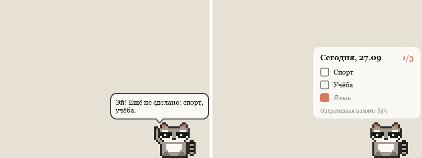
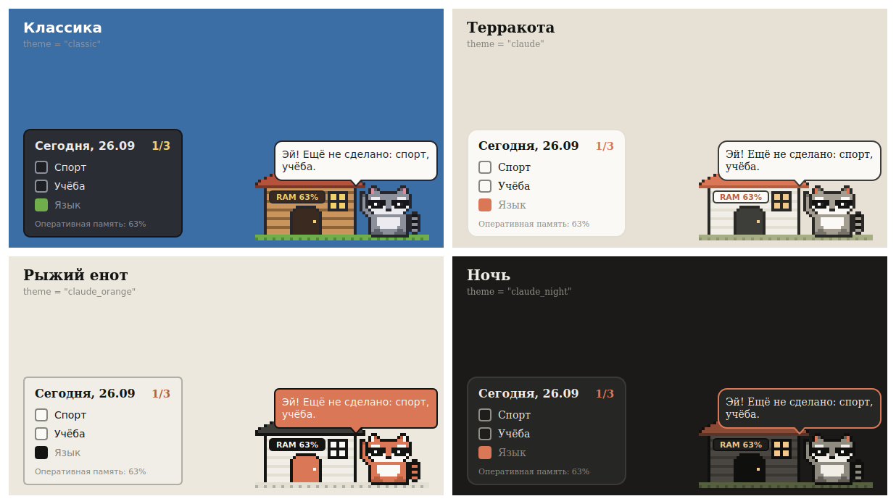

# cloDICK

Лёгкий десктоп-компаньон для Windows с управлением через Telegram.
Пиксельный персонаж живёт на рабочем столе и каждый день напоминает про спорт, учёбу, язык и ваши задачи. Интерфейс на английском. Первый персонаж — енот, своих можно добавлять: [docs/CHARACTERS.md](docs/CHARACTERS.md).



Статус: этап 1 — енот на рабочем столе. Роадмап и стек — в [docs/ROADMAP.md](docs/ROADMAP.md).

## Что умеет сейчас

- Экран для енота — пол, как для Desktop Goose: он гуляет во все стороны, у него есть тень, а в прыжке он от неё отрывается. Далеко от своего места не уходит, радиус задаётся настройкой `roam`. Моргает, иногда засыпает или уходит погулять вдоль края экрана. Сменить его можно в меню «Персонаж». Енота можно перетащить мышью, место запоминается.
- Клик по еноту открывает чек-лист дня. Галочка — задача сделана.
- Свои задачи добавляются строкой внизу чек-листа. Без галочки daily задача разовая: после отметки она видна до конца дня, потом исчезает. С галочкой повторяется каждый день. Крестик удаляет свою задачу.
- Напоминания по расписанию: енот машет лапой и говорит, что осталось.
- Загрузка оперативной памяти написана у енота на пузе. Ещё она есть в чек-листе и в подсказке значка в трее.
- Енот не просто сидит: трёт лапки, зевает, косится на курсор, грызёт печеньку за отмеченную задачу и подпрыгивает от радости. Если провести курсором быстро прямо по нему, он отбежит в сторону. Если подержать курсор на нём, покажет сердечко. Ночью чаще спит. Уворачивание и сердечко выключаются в меню пунктом Playful.
- Меню по правому клику и в трее: чек-лист, показать или спрятать енота, прогулки, напоминания, выход.

## Запуск

Нужны [uv](https://docs.astral.sh/uv/) и Git.

```
git clone https://github.com/dyachenkomark/clodi-k.git
cd clodi-k
git checkout claude/jolly-bell-t6afa7
uv sync
uv run clodick-gui        # енот без консольного окна
```

Обновить до свежей версии и перезапустить енота: `restart.cmd` в папке проекта, двойным кликом или из терминала.

Консольные команды:

```
uv run clodick status
uv run clodick done sport
uv run clodick undo sport
```

## Оформление

Четыре темы, выбираются в `config.toml`: `[desktop] theme = "..."`. По умолчанию `claude` — «Терракота».



| Тема | Как выглядит |
|---|---|
| `classic` | Серый енот, тёмный чек-лист. |
| `claude` | Кремовая бумага, терракотовые акценты, заголовки с засечками. |
| `claude_orange` | Рыжий енот в терракоте, строгий чек-лист. |
| `claude_night` | Тёмная тема с терракотовыми акцентами. |

Пересобрать картинку с темами: `uv run python tools/theme_gallery.py docs/themes.png`.

## Настройки

Данные лежат в `%LOCALAPPDATA%\cloDICK` на Windows и в `~/.local/share/clodick` на других ОС.
Там же `config.toml`: направления, время напоминаний, начало дня, размер енота, прогулки, тема.
Изменения применяются после перезапуска.

## Разработка

```
uv run pytest           # тесты, окно проверяется без экрана
uv run ruff check       # линтер
uv run ruff format      # форматирование
uv run python tools/screenshot.py scene.png   # скриншот сцены без рабочего стола
```

Домик — текстовая карта пикселей в `src/clodick/desktop/art.py`. Персонажи — пакеты в `src/clodick/assets/characters`, формат описан в `docs/CHARACTERS.md`.
Чтобы не трогать настоящие данные при разработке, задайте другой путь:

```
set CLODICK_HOME=.clodick-dev        # Windows cmd
export CLODICK_HOME=.clodick-dev     # bash
```
